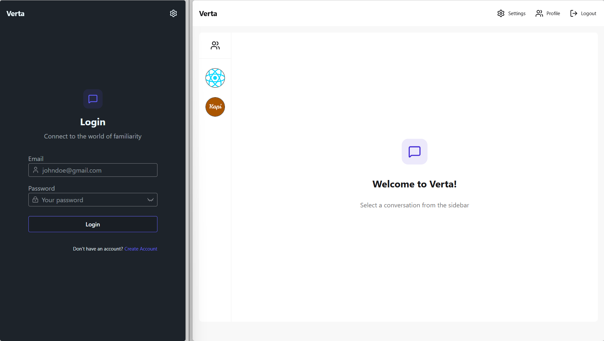
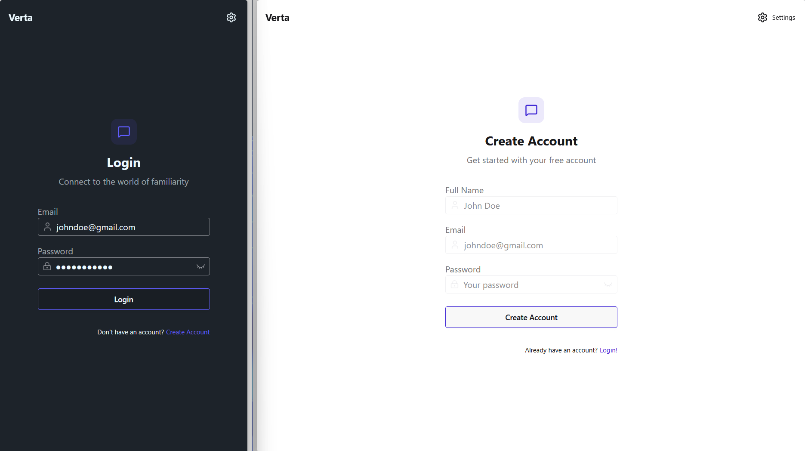
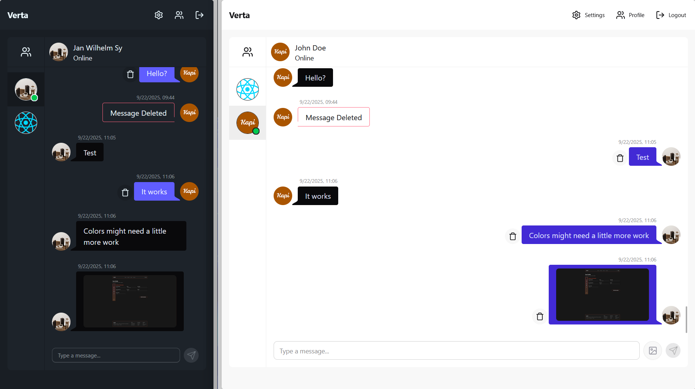
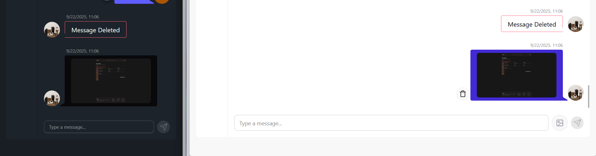
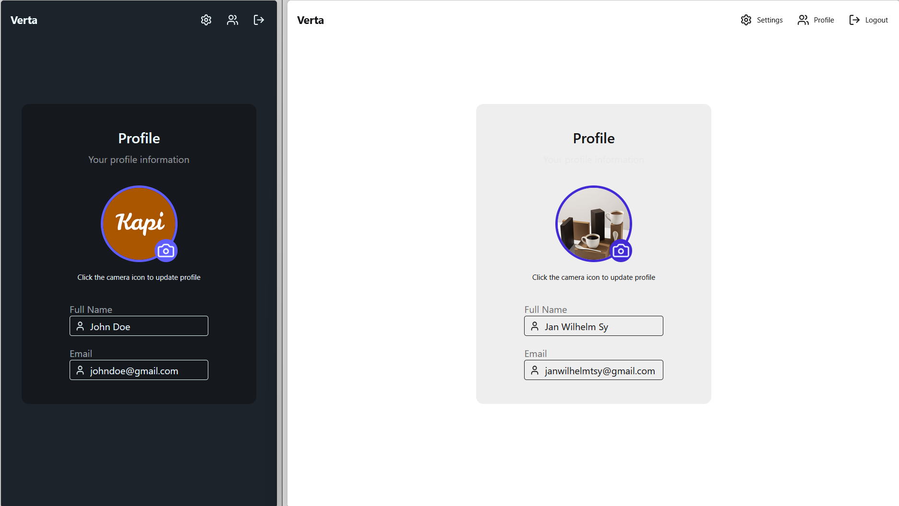
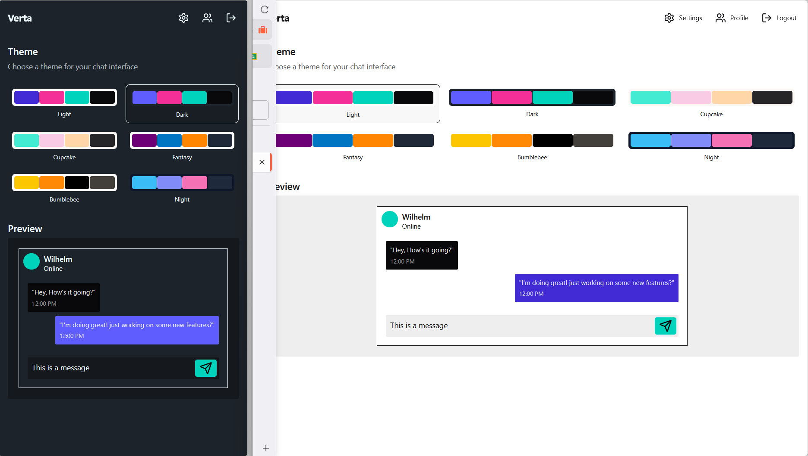

# Verta

**A React-based Realtime chat application**  

Verta is designed as a sample messaging application where users can sign up, log in, customize their profile, and chat in real time. The project serves as a playground for learning full-stack development, experimenting with UI/UX design (**utilizing Daisy UI**), and practicing real-time features with **WebSockets.io**.

  

## ✨ Features  

- **Login / Signup** – Authentication system for account creation and secure login.  
  

- **Realtime Chat** – Send and receive messages instantly with WebSocket integration.
  

- **Delete Messages** – Soft delete messages with a “Message Deleted” indicator.
    

- **Profile Management** – Update personal details and change profile picture.
  

- **Settings (Theme Change)** – Switch between different themes to personalize the chat experience.
  

